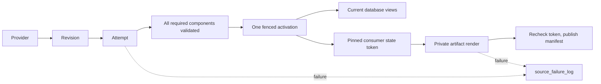

# Source onboarding playbook

**Required reading before drafting a PRD or slice that adds a data source.**
Authors and reviewers must apply this playbook before specifying or implementing
the work. The [PRD template](../../.github/ISSUE_TEMPLATE/prd.yml) and
[Slice template](../../.github/ISSUE_TEMPLATE/slice.yml) require this prerequisite.
Every source uses the same native Dagster operator workflow described below.

A source builds privately. One activation makes its complete component set visible. Consumers publish from a pinned state independently.



| Term | Meaning |
| --- | --- |
| Revision | Adapter-validated immutable identity and normalized content for a bounded partition. |
| Attempt | A fresh UUID isolating every write made by one build. |
| Component | One required output whose count, keys, bounds and hash have been checked. |
| Activation | A monotonically numbered record selecting one complete attempt. |
| Route | A later, separately approved switch of an existing public identity to the new source. |
| Lock | Shared single-host `flock` exclusion; builders and verifiers take a shared maintenance fence and an exclusive partition lock; maintenance takes the exclusive fence. |
| Consumer | An independent publisher that pins the active state, renders privately, and checks its token before replacing a manifest. |

## Add a source

The operator opens **Jobs → `backfill_<source_key>_source_job` → Launch**, selects
native partitions (all history, missing/failed days or a selected gap), and launches.
No operation may require typed YAML, JSON, dates, identifiers, paths or configuration.
Native partition controls provide selection, coverage, failures and retries.
Configuration, dependencies, schemas, mounts, capacity measurement, schedules,
sensors, every declared projection and every file output are versioned code.
A source PR is incomplete if any of these requires a separate human setup or launch.
Source-specific instructions in a chat are not part of the system contract.

### Required code footprint

| Engineer supplies in the source PR | Contract and worked example |
| --- | --- |
| Provider adapters in `adapters/` | Implement `CanonicalAdapter` and, where available, `ProvisionalAdapter` from [contracts.py](../../origo/sources/contracts.py). Own discovery, checksums, completeness, timestamp/identity normalization and provider errors. See [binance_daily.py](../../origo/sources/adapters/binance_daily.py); never copy Binance authority into the kernel. |
| Projection profile in `profiles/` | Declare every `ComponentSpec`: schema, key, time column, build function and provisional/current mapping. See [spot.py](../../origo/sources/profiles/spot.py). |
| Independent verifier in `profiles/` | Supply `spec.verify` with proof for every canonical component of the exact active generation. See [spot_parity.py](../../origo/sources/profiles/spot_parity.py). A new provider needs its own reference evidence; a renamed spot comparator is not proof. |
| Publication profile in `profiles/` | Declare every `ConsumerSpec`, file series, schema, coverage, destination and public/shadow policy. Render from a pinned snapshot and commit a checksummed manifest only after rechecking its token. See [spot_consumers.py](../../origo/sources/profiles/spot_consumers.py). |
| One source specification and registration | Follow [binance_spot_trades.py](../../origo/sources/binance_spot_trades.py): unique key/names, first UTC day, adapters, components, consumers, verifier, retry/schedule policy and rollout stage. Add it once to `SOURCE_REGISTRY` in [registry.py](../../origo/sources/registry.py). |
| Real evidence and tests | Retain official files/response evidence and hashes under `tests/fixtures/<provider>/...`; add source-specific tests under `tests/origo_source_native/`. Synthetic market rows are prohibited. |
| Deployment inputs, when needed | Declare any new credential names and persistent mounts in the deployment configuration. Resolve credentials through the existing secret mechanism; never commit values or require operator shell exports/UI setup for each run. |

Register unfinished work as `DORMANT`. The PR delivering an operator-runnable
source must declare `CANARY` or `LIVE` in code. Both CANARY and LIVE automatically run all declared ingestion/audit schedules
and sensors. CANARY keeps publications in the declared shadow destinations. Public ownership/promotion requires its separate reviewed routing
change. Changing the stage alone does not turn a shadow renderer into a public
uploader.

The shared backfill contract is daily UTC canonical partitions. Providers with
hourly files need an adapter that proves complete daily partitions, or an explicit
extension of the shared partition contract before using this job. Provider-specific
parsing, schemas and verification remain engineering work; orchestration is shared.

### Generated automatically from the registration

| Shared code | What each registered source receives |
| --- | --- |
| [definitions.py](../../origo/definitions.py), [bundle.py](../../origo/sources/bundle.py), [backfill.py](../../origo/sources/backfill.py) | Assets, per-day state, one native partitioned backfill job, operational jobs, source pools, retry policy, schedules and consumer/failure/reconciliation sensors. Do not copy these definitions into a source module. |
| [bootstrap.py](../../origo/sources/bootstrap.py), [prepare.py](../../origo/sources/prepare.py) | Recorded deployment preparation, schemas, declared automation states, preserved cursors and readiness checks. The job repeats source preparation idempotently; deployment configures pool limits before workers start. |
| [lifecycle.py](../../origo/sources/lifecycle.py), [bundle.py](../../origo/sources/bundle.py) | Verified generations, automatic capacity measurement and a publication barrier: every selected day and every declared consumer must finish before backfill success. |
| [bundle.py](../../origo/sources/bundle.py) consumer sensors | Later eligible state changes request publication automatically. Active or failed backfills hold publication; complete current manifests suppress duplicate work. |
| [roles.py](../../origo/maintenance/roles.py), [source_receipts.py](../../origo/maintenance/source_receipts.py) | Protected source/backfill provenance and short retention for standalone projection jobs, with durable deduplication receipts. Keep the generated run tags. |

The framework executes the components and consumers declared by the profile; it
does not infer missing products from a source name. For trade/aggregate-trade
sources, preserve the agreed footprint: raw data; time, dollar, volume, tick and
imbalance bars; aligned data; and Parquet, Arrow and Hugging Face file consumers.
Declare provisional equivalents where supported. Reuse compatible profile
functions, and prove any provider-specific normalization or formula adaptation.
An omitted product or changed meaning requires an explicit reviewed contract
change, not a smaller declaration that happens to pass the shared job.

The current spot file contract is twelve series: six time intervals and six dollar
bar sizes. It does not export every database component. Arrow includes its Parquet
inputs; Hugging Face shadow files retain the legacy 2020 start cutoff. Record the
complete series/schema/coverage contract for each added source, including any
approved difference. The spot adapter stores individual trades: aggregate responses
locate the REST range, while historicalTrades supplies rows.

### Acceptance evidence required in every source PR

Use [test_source_backfill_job.py](../../tests/origo_source_native/test_source_backfill_job.py)
as the executable worked example. Add equivalent evidence using the **new source's
own specification and real files**; passing the existing spot tests alone does not
certify another source.

| Required proof | Reference test/scenario |
| --- | --- |
| Empty ClickHouse source schema and empty Dagster automation state; one job produces verified generations and every expected file with matching checksums/state tokens | `test_one_job_prepares_verifies_and_publishes_all_files`; assert the expected product list explicitly, not just whatever the new spec happens to declare. |
| Missing/invalid provider input fails the correct day, preserves completed days and blocks publication | `test_unavailable_day_blocks_publication_and_preserves_completed_day` |
| Publication failure fails the same run; retry preserves source generations and already committed files | `test_file_failure_fails_job_and_retry_keeps_verified_generation` |
| A changed eligible generation triggers consumers; unchanged state does not; retiring projection history preserves deduplication | `test_new_verified_data_automatically_requests_every_consumer` and `test_projection_runs_retire_without_losing_source_history_or_receipts` |
| Repeated deployment restores declared automation without losing cursors; new storage remeasures verification; setup failures appear in Runs | `test_preparation_applies_rollout_state_without_manual_switches`, `test_storage_change_remeasures_independent_verification`, `test_deployment_preparation_failures_are_dagster_runs` |
| Actual UI matches system state | Open Jobs and launch the generated backfill through native partition controls on an isolated instance, without typing configuration. Verify all-history, missing/failed and selected-gap controls, coverage, successful and failed real-fixture runs, retries and logs. Record evidence in the PR; do not launch production history as a test. |

Run the new source tests, the shared backfill/framework tests and
`pytest tests/origo_source_native -q`, then the repository gates. The required
`.github/workflows/pr_checks_tests.yml` / `pr_checks_tests` job runs this suite on
every PR. Shared regression tests protect the framework; the source author and
reviewer must ensure the new source's acceptance cases are actually included.
`test_binance_daily_source_adapter.py` is the existing provider-test example.

Include the source key, rollout, exact product inventory, credential/mount names
and acceptance commands/results in the source's slice/PR. The reviewer rejects
manual activation/setup steps, missing products and unsupported claims of parity.
After merge/deployment, hand the operator the generated job name; native partition controls provide the selection and coverage.
Full-history production validation and public promotion remain separate evidence.

## Run and promote

Source setup, managed sensor state, shared mounts and readiness are versioned code. Both Compose configurations run `python -m origo.sources.bootstrap` before starting the daemon. This executes the recorded `prepare_revisioned_sources_job`; preparation errors and logging appear in Dagster Runs. Their healthcheck verifies preparation without changing state. Re-deployment applies the declared rollout while retaining sensor cursors: DORMANT stops all managed automation; CANARY and LIVE run every declared schedule and sensor automatically. Dormant sources perform no external preparation I/O. The job repeats this idempotent preparation, so a fresh instance follows the same path.

### Backfill and compare from Dagit

Open **Jobs → backfill_binance_spot_trades_source_job → Launch**. Use native
partition selection for all available closed UTC days, missing/failed days or a
particular gap. Launch the selection once. No text configuration or separate
preparation/projection/publication launch is required. The first available day is
registered in code; the partition calendar advances automatically. A missing
provider archive is a visible failure, never silently skipped.

The shared factory generates a native daily-partitioned asset job using
`BackfillPolicy.multi_run(max_partitions_per_run=1)`. Dagster launches independent
daily runs under a code-owned canonical concurrency pool. Native Jobs backfills
include the canonical asset, every file consumer and final reconciliation in each
child run. The canonical step records its verified generation against that
backfill's selected dates in `source_backfill_log`. Until every selected date has
its own current verified receipt, it records its materialization and omits its
optional output; Dagster skips its downstream steps. The last completing child
runs all file consumers and final reconciliation. Existing generations from
before this backfill do not satisfy queued work. Simultaneous final children
serialize and deduplicate each consumer against its current manifest.
Native asset backfills use Dagster's upstream partition dependency barrier.
File failure keeps the backfill unsuccessful and native retry resumes it.
The operator still selects the period once, without entering configuration.

Canonical workers share a maintenance fence and exclusively lock their own
partition. Different days have separate staging and independent comparison
databases. Source-wide cleanup takes the exclusive maintenance fence. The
canonical pool is separate from serial maintenance/publication pools. Capacity
reserves include the configured maximum concurrent working sets.

The data path uses native Polars/Arrow parsing and bulk transport, ClickHouse
projections and SHA256 of fixed, ordered 65,536-row RowBinary chunks computed
inside ClickHouse. Only chunk digests cross the wire; the root hash binds the
schema, encoding, chunk sizes and counts. Query
aggregation uses one thread per daily worker to retain deterministic floating-point
reduction; parallelism is across independent days. New component hashes have a
`v2:` prefix; existing v1 generations are checked with their original encoding.
Retries reuse the original generation. Existing data schemas and public identities remain unchanged; the backfill receipt table is additive.
The reference parser independently uses Arrow CSV and is checked against the
frozen legacy parser on real millisecond and microsecond files. Legacy projection
formulas remain unchanged.

Performance evidence must name rows, elapsed time, worker count, hardware,
seconds per million, memory and whether verification/publication/network are
included. Measure representative high-volume archives at increasing concurrency;
small-fixture correctness is not full-history throughput evidence.

Each verified day materializes its source partition with revision, build ID,
generation, verification time, data version and comparison results. Completed
days remain visible when another day fails. Python logging and stdout/stderr flow
through Dagster. Native backfill and run retry controls handle failures; unchanged
verified generations and completed file publications are reused on retry.

After the selected days verify, native downstream steps publish every declared
consumer from pinned projections. A publication failure fails that consumer and
the native backfill; final reconciliation checks current manifests and health. Files expose their own
materializations and source tokens; a source partition's successful verification
does not claim that a failed file publication succeeded. Publication queries pinned
ClickHouse projections without copying the historical raw trade archive into
Python. Consumer sensors also publish later eligible source changes automatically.
Active backfills hold background publication and verification reconciliation.

Backfill runs preserve authoritative source provenance. Standalone consumer jobs are generated into the existing projection-retention allowlist, use a distinct projection-source tag, and preserve durable deduplication receipts before their run history is retired.

The shared `source-publications` volume preserves manifests and files across worker replacement. The CANARY spot specification declares Parquet, Arrow and Hugging Face **shadow** files; this does not upload over the legacy public Hugging Face datasets. Legacy public identities retain their existing owners until the separately approved LIVE routing promotion. CANARY schedules run automatically for new data and audit work; full-history backfills remain an operator partition selection.

Dagit reflects the latest verified and reconciled state, not an atomic transaction with ClickHouse. Reconciliation observes failures and repairs missing/stale asset materializations. Its health check must be healthy alongside the backfill result. Fixture tests prove this workflow, not parity across the entire production history; that evidence comes from the operator's selected backfill.

Promotion still requires `zero-bang` approval of the full-history proof and public routing change. Use the source `rollback` operation for a deliberate generation rollback; never overwrite activation history.

## Failure scope

| Scope | Blocking effect |
| --- | --- |
| `NONE` | Diagnostic, audit or cleanup work only; no database activation dependency. |
| `CONSUMER` | That publisher only; database and other consumers continue. |
| `PARTITION` | The affected partition attempt only; its previous complete generation stays visible. |
| `SOURCE` | An explicitly source-wide prerequisite only. |
| `ROUTE` | The named future route change only; the current route stays active. |

Handled failures record before re-raising. The managed run-failure observer records uncaught job/worker failures for enabled sources. Recovery and acknowledgement append to the same failure key; deterministic event IDs make logger retries idempotent. Successful component and activation tables are correctness evidence, not alternate failure histories. Canonical discovery records its partition before provider I/O; the hourly audit retries up to five oldest requested partitions that have never activated, so a missing sidecar cannot drop a day. Canonical run keys still include the validated revision.

```sql
SELECT source_key, failure_key,
       argMax((event_type, severity, blocking_scope, operation, partition_key,
               component, consumer, error_code, message, dagster_run_id), event_time) AS latest
FROM origo.source_failure_log
GROUP BY source_key, failure_key
ORDER BY source_key, failure_key;
```

## Change the contract

When evidence invalidates the slice, capture the failing command and exact proposed issue-body edit. Obtain explicit `zero-bang` confirmation, then update every affected assertion, signature, surface and proof before continuing:

```sh
gh issue view 309 --repo Vaquum/Origo --json body
gh issue edit 309 --repo Vaquum/Origo --body-file approved-slice.md
```

CI success, silence, or a workaround is not approval to change the contract.


Use `PYTHONPATH=. python tools/benchmark_source_backfill.py --archives <cache>
--days <real dates> --workers 1 2 4 --output <report.json>` for an isolated developer
benchmark. It validates official archive sidecars, owns a local ClickHouse
container, and records the frozen legacy ingest/projections separately from the
revised build, independent parity verification and all declared shadow files.
The report excludes Dagster startup and network upload; measure those in the
native GUI acceptance run as well. This is a developer benchmark, not an
operator backfill procedure.
