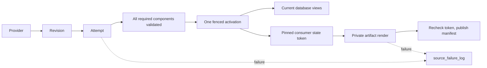

# Revisioned sources

A source builds privately. One activation makes its complete component set visible. Consumers publish from a pinned state independently.



| Term | Meaning |
| --- | --- |
| Revision | Adapter-validated immutable identity and normalized content for a bounded partition. |
| Attempt | A fresh UUID isolating every write made by one build. |
| Component | One required output whose count, keys, bounds and hash have been checked. |
| Activation | A monotonically numbered record selecting one complete attempt. |
| Route | A later, separately approved switch of an existing public identity to the new source. |
| Lock | Shared single-host `flock` exclusion; canonical operations take heavy then partition, while provisional operations take their partition lock. |
| Consumer | An independent publisher that pins the active state, renders privately, and checks its token before replacing a manifest. |

## Add a source

This is the onboarding playbook for every registered source. The operator contract
is **Jobs → `backfill_<source_key>_source_job` → dates → Launch Run**. A source PR is
incomplete if the operator must create tables, enable sensors, run a capacity
probe, launch projections or publish files separately. Deployment and the shared
job own that preparation. Source-specific instructions in a chat are not part of
the system contract.

### Required code footprint

| Engineer supplies in the source PR | Contract and worked example |
| --- | --- |
| Provider adapters in `adapters/` | Implement `CanonicalAdapter` and, where available, `ProvisionalAdapter` from [contracts.py](contracts.py). Own discovery, checksums, completeness, timestamp/identity normalization and provider errors. See [binance_daily.py](adapters/binance_daily.py); never copy Binance authority into the kernel. |
| Projection profile in `profiles/` | Declare every `ComponentSpec`: schema, key, time column, build function and provisional/current mapping. See [spot.py](profiles/spot.py). |
| Independent verifier in `profiles/` | Supply `spec.verify` with proof for every canonical component of the exact active generation. See [spot_parity.py](profiles/spot_parity.py). A new provider needs its own reference evidence; a renamed spot comparator is not proof. |
| Publication profile in `profiles/` | Declare every `ConsumerSpec`, file series, schema, coverage, destination and public/shadow policy. Render from a pinned snapshot and commit a checksummed manifest only after rechecking its token. See [spot_consumers.py](profiles/spot_consumers.py). |
| One source specification and registration | Follow [binance_spot_trades.py](binance_spot_trades.py): unique key/names, first UTC day, adapters, components, consumers, verifier, retry/schedule policy and rollout stage. Add it once to `SOURCE_REGISTRY` in [registry.py](registry.py). |
| Real evidence and tests | Retain official files/response evidence and hashes under `tests/fixtures/<provider>/...`; add source-specific tests under `tests/origo_source_native/`. Synthetic market rows are prohibited. |
| Deployment inputs, when needed | Declare any new credential names and persistent mounts in the deployment configuration. Resolve credentials through the existing secret mechanism; never commit values or require operator shell exports/UI setup for each run. |

Register unfinished work as `DORMANT`. The PR delivering an operator-runnable
source must declare `CANARY` or `LIVE` in code. CANARY enables verification and
shadow publications; LIVE additionally enables the declared ingestion/audit
schedules. Public ownership/promotion requires its separate reviewed routing
change. Changing the stage alone does not turn a shadow renderer into a public
uploader.

The current period-job contract is daily UTC canonical partitions. Providers with
hourly files need an adapter that proves complete daily partitions, or an explicit
extension of the shared partition contract before using this job. Provider-specific
parsing, schemas and verification remain engineering work; orchestration is shared.

### Generated automatically from the registration

| Shared code | What each registered source receives |
| --- | --- |
| [definitions.py](../definitions.py), [bundle.py](bundle.py), [backfill.py](backfill.py) | Assets, per-day state, one period backfill job, operational jobs, source pools, retry policy, schedules and consumer/failure/reconciliation sensors. Do not copy these definitions into a source module. |
| [bootstrap.py](bootstrap.py), [prepare.py](prepare.py) | Recorded deployment preparation, schemas, declared automation states, preserved cursors and readiness checks. The job repeats preparation idempotently. |
| [lifecycle.py](lifecycle.py), [publication.py](publication.py) | Verified generations, automatic capacity measurement and a publication barrier: every selected day and every declared consumer must finish before backfill success. |
| [bundle.py](bundle.py) consumer sensors | Later eligible state changes request publication automatically. Active or failed backfills hold publication; complete current manifests suppress duplicate work. |
| [roles.py](../maintenance/roles.py), [source_receipts.py](../maintenance/source_receipts.py) | Protected source/backfill provenance and short retention for standalone projection jobs, with durable deduplication receipts. Keep the generated run tags. |

The framework executes the components and consumers declared by the profile; it
does not infer missing products from a source name. For trade/aggregate-trade
sources, preserve the agreed footprint: raw data; time, dollar, volume, tick and
imbalance bars; aligned data; and Parquet, Arrow and Hugging Face file consumers.
Declare provisional equivalents where supported. Reuse compatible profile
functions, and prove any provider-specific normalization or formula adaptation.
An omitted product or changed meaning requires an explicit reviewed contract
change, not a smaller declaration that happens to pass the shared job.

The current spot file contract is twelve series: six time intervals and six dollar
bar sizes. It does not export every database component. Arrow includes its Parquet
inputs; Hugging Face shadow files retain the legacy 2020 start cutoff. Record the
complete series/schema/coverage contract for each added source, including any
approved difference. The spot adapter stores individual trades: aggregate responses
locate the REST range, while historicalTrades supplies rows.

### Acceptance evidence required in every source PR

Use [test_source_backfill_job.py](../../tests/origo_source_native/test_source_backfill_job.py)
as the executable worked example. Add equivalent evidence using the **new source's
own specification and real files**; passing the existing spot tests alone does not
certify another source.

| Required proof | Reference test/scenario |
| --- | --- |
| Empty ClickHouse source schema and empty Dagster automation state; one job produces verified generations and every expected file with matching checksums/state tokens | `test_one_job_prepares_verifies_and_publishes_all_files`; assert the expected product list explicitly, not just whatever the new spec happens to declare. |
| Missing/invalid provider input fails the correct day, preserves completed days and blocks publication | `test_unavailable_day_blocks_publication_and_preserves_completed_day` |
| Publication failure fails the same run; retry preserves source generations and already committed files | `test_file_failure_fails_job_and_retry_keeps_verified_generation` |
| A changed eligible generation triggers consumers; unchanged state does not; retiring projection history preserves deduplication | `test_new_verified_data_automatically_requests_every_consumer` and `test_projection_runs_retire_without_losing_source_history_or_receipts` |
| Repeated deployment restores declared automation without losing cursors; new storage remeasures verification; setup failures appear in Runs | `test_preparation_applies_rollout_state_without_manual_switches`, `test_storage_change_remeasures_independent_verification`, `test_deployment_preparation_failures_are_dagster_runs` |
| Actual UI matches system state | Open the generated Jobs/Launchpad/Runs views on an isolated instance. Inspect a successful and failed real-fixture run, per-day materializations and errors/logs. Record evidence in the PR; do not launch production history as a test. |

Run the new source tests, the shared backfill/framework tests and
`pytest tests/origo_source_native -q`, then the repository gates. The required
`.github/workflows/pr_checks_tests.yml` / `pr_checks_tests` job runs this suite on
every PR. Shared regression tests protect the framework; the source author and
reviewer must ensure the new source's acceptance cases are actually included.
`test_binance_daily_source_adapter.py` is the existing provider-test example.

Include the source key, rollout, exact product inventory, credential/mount names
and acceptance commands/results in the source's slice/PR. The reviewer rejects
manual activation/setup steps, missing products and unsupported claims of parity.
After merge/deployment, hand the operator the generated job name and date inputs;
full-history production validation and public promotion remain separate evidence.

## Run and promote

Source setup, managed sensor state, shared mounts and readiness are versioned code. Both Compose configurations run `python -m origo.sources.bootstrap` before starting the daemon. This executes the recorded `prepare_revisioned_sources_job`; preparation errors and logging appear in Dagster Runs. Their healthcheck verifies preparation without changing state. Re-deployment applies the declared rollout while retaining sensor cursors: DORMANT stops all managed automation, CANARY runs monitors and consumer sensors, and LIVE also runs declared ingestion/audit schedules. Dormant sources perform no external preparation I/O. The job repeats this idempotent preparation, so a fresh instance follows the same path.

### Backfill and compare from Dagit

Open **Jobs → backfill_binance_spot_trades_source_job → Launchpad**, choose the inclusive UTC period, and launch once:

```yaml
ops:
  select_period:
    config:
      start_date: "2017-08-17"
      end_date: ""
```

Empty start means the source's declared first day; empty end means yesterday UTC at launch. Empty configuration selects the whole closed history. There are no setup jobs, sensor switches, capacity probes, asset-navigation steps or separate publication jobs for the operator. A missing provider archive is a visible failed day; it is never silently skipped.

The shared factory generates `select_period → build_and_verify[day] → publish_files` for every registered source. Each selected day is a separate Dagster step in one run. Execution is sequential in the source heavy pool. A full-history run is exempt from the short operational-job runtime limit; Dagster continues monitoring worker failures. Storage admission retains the 30% free-byte, twice-measured-working-set and 10% free-inode requirements. The first use of new storage measures a complete build and independent comparison automatically; cached parity cannot substitute for that measurement.

Each successful day materializes its native source asset partition with revision, build ID, generation, verification time, data version and all seven legacy comparison results. Python logging and stdout/stderr flow through Dagster. Failed days keep their failure history; the publication step cannot run unless every selected day succeeds. Native re-execution can retry failed steps; relaunching the same period validates and reuses unchanged generations.

Publication runs once after the selected period, rather than rebuilding all files after every day. The spot renderer queries pinned time/dollar projections in ClickHouse without loading the historical raw trade archive into Python. Every declared consumer must complete before the job succeeds. File failures fail the same run. Consumer sensors defer while a backfill is active or its latest attempt failed/canceled, and do not republish an already current manifest. Retrying reuses complete files already committed for the same source token. Reconciliation continues health observations while leaving verification to the active job.

Backfill runs preserve authoritative source provenance. Standalone consumer jobs are generated into the existing projection-retention allowlist, use a distinct projection-source tag, and preserve durable deduplication receipts before their run history is retired.

The shared `source-publications` volume preserves manifests and files across worker replacement. The CANARY spot specification declares Parquet, Arrow and Hugging Face **shadow** files; this does not upload over the legacy public Hugging Face datasets. Legacy public identities retain their existing owners until the separately approved LIVE routing promotion. CANARY ingestion schedules remain stopped by code, so deployment does not launch the full historical workload itself.

Dagit reflects the latest verified and reconciled state, not an atomic transaction with ClickHouse. Reconciliation observes failures and repairs missing/stale asset materializations. Its health check must be healthy alongside the backfill result. Fixture tests prove this workflow, not parity across the entire production history; that evidence comes from the operator's selected backfill.

Promotion still requires `zero-bang` approval of the full-history proof and public routing change. Use the source `rollback` operation for a deliberate generation rollback; never overwrite activation history.

## Failure scope

| Scope | Blocking effect |
| --- | --- |
| `NONE` | Diagnostic, audit or cleanup work only; no database activation dependency. |
| `CONSUMER` | That publisher only; database and other consumers continue. |
| `PARTITION` | The affected partition attempt only; its previous complete generation stays visible. |
| `SOURCE` | An explicitly source-wide prerequisite only. |
| `ROUTE` | The named future route change only; the current route stays active. |

Handled failures record before re-raising. The managed run-failure observer records uncaught job/worker failures for enabled sources. Recovery and acknowledgement append to the same failure key; deterministic event IDs make logger retries idempotent. Successful component and activation tables are correctness evidence, not alternate failure histories. Canonical discovery records its partition before provider I/O; the hourly audit retries up to five oldest requested partitions that have never activated, so a missing sidecar cannot drop a day. Canonical run keys still include the validated revision.

```sql
SELECT source_key, failure_key,
       argMax((event_type, severity, blocking_scope, operation, partition_key,
               component, consumer, error_code, message, dagster_run_id), event_time) AS latest
FROM origo.source_failure_log
GROUP BY source_key, failure_key
ORDER BY source_key, failure_key;
```

## Change the contract

When evidence invalidates the slice, capture the failing command and exact proposed issue-body edit. Obtain explicit `zero-bang` confirmation, then update every affected assertion, signature, surface and proof before continuing:

```sh
gh issue view 309 --repo Vaquum/Origo --json body
gh issue edit 309 --repo Vaquum/Origo --body-file approved-slice.md
```

CI success, silence, or a workaround is not approval to change the contract.

## Operational metadata maintenance

`maintain_operational_metadata_job` is the Dagit entry point. The
`operational_metadata_maintenance_schedule` runs every 10 minutes; deployment launches
this same job through the configured project workspace. Deployments start in inspection mode. The configured SQLite adapters
fix the Jobs-page repository query and preserve current materialization/observation
IDs, tags, data versions and partition facts after their old run details expire.
ClickHouse's native 14-day diagnostic TTL operates independently of this schedule.
Source tables, reconciliation state, accepted revisions and published data are outside
this retention policy.

Source ingestion, mixed ingestion/projection jobs and unknown jobs retain their run
records indefinitely. The explicit policy is `origo/maintenance/roles.py`;
`origo_source_key` also marks source work. Run deletion itself checks this policy
atomically, so a source tag added after inventory still prevents retirement.
Source provenance includes the full event history, acceptance/failure evidence,
source generation and validation references. After one hour without shard activity,
terminal source event databases are losslessly compressed into
`operational-maintenance/source-archive.sqlite`. Dagit reads the original database
schema from memory, preserving event IDs, timestamps, payloads and pagination.
The shared run/event indexes also compress source JSON payloads losslessly;
query keys, statuses, timestamps, tags and every historical entry remain intact.
Both Origo adapters decode these versioned, checksummed payloads transparently.
Direct SQLite inspection must use `origo.maintenance.sqlite.connection` to obtain
decoded rows. Keep the compatible adapters when rolling back application code;
an older adapter cannot read the packed format. Captured logs are retained.
A late event restores the shard durably under its writer lock before appending; interrupted transitions prefer the committed,
checksum-verified archive. Corrupt images fail visibly rather than creating empty
history. Images above 64 MiB remain unmodified and appear as an inventory exclusion.
Dagster schema upgrades migrate one packed database at a time during an outage.

Explicit projection jobs include bars, derived depth tables, Arrow and published
files. Successful histories are eligible after a one-minute shutdown grace; resolved failed/canceled
histories after 24 hours. Current asset facts keep their original IDs, tags, input
versions and partitions after a projection run expires. Active runs, active/unknown
backfills, retries, current checks, unresolved failures and unconsumed sensor events
remain protected. Later materializations for every planned asset can resolve an older failure even after the successful run records expire; that run’s own materializations cannot clear its failure. Fresh checks precede each deletion. Unchanged Parquet inputs do
not launch another Arrow build. Terminal successful/skipped sensor and schedule
ticks expire after one day; failed ticks after seven days. Instigator cursors and
source run evidence are independent of those operational tick logs.

### First inspection and cleanup

1. In Dagit, launch `maintain_operational_metadata_job` with the configuration below.
   The deployment default permits at most ten minutes, in batches of at most 500 runs.
   Scan, reclamation and compaction use a separate work deadline. Reporting gets
   10% of runtime, bounded to 15–300 seconds and at most half the usable runtime
   for short invocations. Exhausting the work window reports the last durable
   checkpoint and resumes on the next invocation. Disk measurement counts allocated
   blocks without following symlinks, counts hard links once, and logs paths that disappear during
   traversal. Missing configured roots, permission and I/O errors still fail the run,
   as does exhausting the absolute reporting deadline.
   Inventory reads at most 500 run records in run-ID order, without sorting the
   remaining backlog. Retry references and sensor state are loaded once per batch;
   one read-only event connection is scoped to the batch. Reclamation still checks
   fresh dependencies for each run under its writer lock.
   Each completed batch checkpoints its cursor. Repeat until the result says
   `inventory_complete: true`; an incomplete inventory is not a deletion approval.
   Once an eligible first manifest has a complete inventory, scheduled and deploy
   dry runs preserve its inventory totals, retained floor and manifest through
   backup preparation and review. Health, current disk usage and diagnostic checks
   continue. Inventories without eligible runs continue scanning; first apply or a
   retention-policy change permits a new inventory cycle.
2. Read `maintenance` in the health check metadata and its `journal_path`. The one
   journal contains the exact first manifest, artifact paths/allocated bytes,
   exclusions, `archive`/`retire` actions and SHA-256. The physical ceiling defaults
   to 13 GiB; health also requires strictly less than 10% of ClickHouse active
   business-data bytes. Shared databases, source archives, live shards, logs and
   maintenance state all count. Diagnostic tables never inflate the denominator.
   An over-budget instance may perform approved cleanup, but its check remains
   failed until actual physical usage meets both limits. The old retained-floor
   estimate includes reusable SQLite pages and is not an admission barrier.
3. Before first apply, take a consistent snapshot of **the entire Dagster instance**
   and compute logs using the storage platform's atomic snapshot facility, or a
   controlled writer-quiesced copy. Copying separate live SQLite files is not a
   consistent instance backup. Restore it on a separate filesystem outside the
   production reserve; rewrite its `dagster.yaml` paths to that restored directory.
   Keep the original run-storage instance ID and both configured Origo adapters.
4. From the deployed application environment, verify that restored instance using
   `python -m origo.maintenance.worker --config '<inspection JSON>'
   --verify-restored-home /mnt/off-volume/origo-restore --snapshot-id '<snapshot ID>'`.
   Save the returned JSON as the backup receipt. Verification checks database
   integrity, instance identity and the manifest's run/shard evidence. The operator
   supplies the snapshot's consistency guarantee; this command does not create a
   backup or turn a live file copy into one.
5. Review the exact manifest. In Dagit set `dry_run: false`, the measured budget,
   `backup_receipt` to the readable receipt path and `approved_manifest_sha256` to
   that exact manifest hash. The first batch requires a matching, unexpired receipt;
   later batches use the durable first-apply checkpoint and revalidate each run.
   Failure/timeout is a failed run and check, with progress retained for another run.
6. After the first batch's state and physical release have been reconciled, enable
   recurring apply with repository variables `ORIGO_METADATA_DRY_RUN=false`,
   `ORIGO_OPERATIONAL_METADATA_BUDGET_BYTES=<measured bytes>` and
   `ORIGO_METADATA_MAX_RUNTIME_SECONDS=600`, then deploy. Repeat bounded Dagit
   invocations during catch-up until eligible backlog declines faster than ingress.

```yaml
ops:
  maintain_operational_metadata:
    config:
      dry_run: true
      projection_success_minutes: 1
      projection_failure_hours: 24
      source_archive_after_hours: 1
      diagnostic_retention_days: 14
      max_runs_per_batch: 500
      max_runtime_seconds: 600
      lock_wait_seconds: 1
      metadata_budget_bytes: 13958643712
```

The first manifest stays available across inspection batches. Its initial eligibility
reason is immutable; live revalidation exclusions are separate progress fields and
do not invalidate the approved hash or backup receipt. Policy changes reset
inspection; finish an interrupted deletion before changing policy. The journal holds
at most 500 candidates and 32 aggregate reports from the last 30 days. The backup
receipt expires after 30 days. Configure the external backup service to expire these
maintenance snapshots after 30 days; Origo does not delete external backups.

### Reading the result

All worker output and exceptions flow into Dagit logs. The blocking
`operational_metadata_health` check reports candidate/protected/deleted/archived counts,
exclusion reasons, age-eligible projection backlog (including protected projections), inferred eligible
arrival rate, cleanup rate, query p95, byte budget, last healthy invocation and free
filesystem bytes. Arrival rate uses the observed backlog change plus deletions;
concurrent manual deletion can understate arrivals. Active cleanup throughput and
between-invocation cleanup rate are separate measurements. Required state is never
deleted to force a budget to pass.

`reclaimed_bytes` includes removed projection artifacts, net source-archive savings
and measured shared-database release. `shared_sqlite.*.reusable_bytes` is still
allocated until page reclamation returns it to the filesystem. Initial conversion
requires a controlled outage with all Dagster/Dagit writers quiesced and a verified
backup. Run `python tools/metadata_compact_sqlite.py --instance-home <home>
--backup-receipt <receipt.json> --writers-quiesced --max-runtime-seconds 900` under
an independent timeout that always resumes both services. It copies no rows between
logical histories: SQLite VACUUM preserves records and enables incremental vacuum.
A failed conversion leaves the original committed database recoverable. Subsequent
maintenance reclaims free pages in bounded transactions and checkpoints the WAL;
`sqlite_compaction_not_initialized` identifies databases still needing conversion.
Do not run initial VACUUM against active production writers. Preserve the full
maintenance output and attach it to the Dagit maintenance run after services resume.
 ClickHouse reports active, inactive and
expired part bytes separately from actual allocated blocks and net physical release.
A scheduled TTL operation is not claimed as reclaimed space.

ClickHouse catch-up first flushes configured system logs, creating empty tables for
unused logs such as crash/backup logs before auditing their TTLs. It then validates
the explicit diagnostic table allowlist and archived numeric schema incarnations. It drops only parts whose actual maximum event time is
older than 14 days. Mixed-age partitions use at most one asynchronous TTL mutation,
with a 4 GiB partition limit and at least 20 GiB plus twice the partition's bytes free.
Concurrent merges/mutations exclude their tables. Inventory limits (500 system
MergeTree tables, 5,000 diagnostic parts) fail visibly instead of applying an
incomplete inventory. TTL drift, lag over the configured allowance, failed mutations,
unknown growing system tables and insufficient catch-up capacity fail the health
check. Native TTL may release inactive parts later; repeated measurement establishes
physical recovery. The OpenTelemetry timestamp is microseconds and is converted to
seconds before applying the same retention window.

Production acceptance remains a deployment step: run the unchanged setup/Arrow
GraphQL job-history queries 20 times, require p95 ≤250 ms after restart and under
normal ingestion, inspect the Jobs page, then reconcile the reviewed cleanup batch.
Only measured recovered space counts toward the backfill reserve.

Migration acceptance additionally requires `python tools/metadata_capacity_report.py
--evidence <measured-evidence.json>`. Its schema is `CapacityEvidence`: every source
identity and history must match, all retained captured logs must be verified, current
Dagit state must match, and an actual replay at ten times observed ingress must leave
no growing projection backlog. Missing proof or a failed storage/latency condition
exits nonzero. Compression samples and lower-bound capacity estimates do not certify
production. Source retention grows with authoritative coverage; if required evidence
cannot fit the capacity limits, the check fails instead of discarding it.


Small asset outputs (up to 64 KiB in Dagster's existing serialized form) share
`storage/.origo-outputs.sqlite`. Their bytes and checksums are preserved; normal
Dagster input loads, partition paths and overwrite behavior use the packed IO
manager. New handled-output metadata identifies the database and its storage key.
Larger values and run-scoped op outputs keep their filesystem representation.
Both services select `origo.maintenance.io_manager.packed_io_manager` through
Dagster's default IO-manager environment settings; silent fallback is disabled.

After every writer uses that manager, migrate existing asset outputs with
`python tools/metadata_pack_outputs.py --instance-home <home> --backup-receipt
<receipt.json> --all-writers-use-packed-io --max-runtime-seconds 600`. It uses the
same per-output locks as live writes, commits at most 100 values together, verifies
all committed bytes, and only then unlinks their original files. Interrupted runs
resume from remaining files. A conflicting raw/packed value fails visibly and
retains both. Preserve this migration's output with the maintenance run. Rollback
must retain the packed IO manager as well as both compatible SQLite adapters.

A source run whose history is still being read or written is deferred to the next
inventory. Lock contention is reported as `source_in_use`, leaves the source
history intact, and creates no compaction error; unrelated projection retirement
continues. Genuine snapshot, integrity and I/O failures retain their error status
until compaction succeeds.

Source event transitions lock only the affected run. A slow archive or historical
read cannot take a global lock away from unrelated runs' live logging. Packed
reads release the transition lock after obtaining their immutable image. Database
upgrades and instance wipes retain Dagster's quiesced-instance requirement.

Local run-status sensor dependencies are matched by repository as well as job name.
A cursor left by a renamed code location cannot pin a different repository's new
projection runs. Current repository cursors still protect unconsumed events. Failure
protection tests for a newer matching run directly, without sorting all historical
runs to find the latest one.

A source shard that cannot be compacted does not stop unrelated projection
retirement. Its original history remains available; the full exception reaches
Dagit logs and a per-run error stays in the archive database. The health check
continues to fail with the unresolved count and a bounded sample of errors across
later invocations. Successful compaction clears that run's error. A failure after
archive commit still retries its unfinished shared-JSON compaction. Work deadlines
remain resumable checkpoints; a broken shared storage backend still fails the job.

Metadata cleanup reuses database engines while opening a fresh connection and
transaction for each storage operation. Retired native event shards are unlinked
through the existing guarded artifact phase without initializing or migrating
their discarded schema. Live retry references are queried at each retirement;
sensor state is reused only while the scheduler database's `data_version` is
unchanged on one autocommit connection. A commit during a sensor-state read causes
a fresh read before the candidate can be retired. The work deadline still applies.
