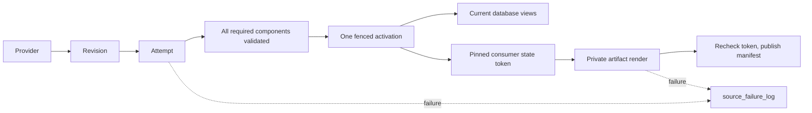

# Revisioned sources

A source builds privately. One activation makes its complete component set visible. Consumers publish from a pinned state independently.



| Term | Meaning |
| --- | --- |
| Revision | Adapter-validated immutable identity and normalized content for a bounded partition. |
| Attempt | A fresh UUID isolating every write made by one build. |
| Component | One required output whose count, keys, bounds and hash have been checked. |
| Activation | A monotonically numbered record selecting one complete attempt. |
| Route | A later, separately approved switch of an existing public identity to the new source. |
| Lock | Shared single-host `flock` exclusion; canonical operations take heavy then partition, while provisional operations take their partition lock. |
| Consumer | An independent publisher that pins the active state, renders privately, and checks its token before replacing a manifest. |

## Add a source

1. Use `binance_spot_trades.py` as the worked example: one typed specification, explicit component and consumer functions, and adapter-owned authority. For a new provider, first implement its canonical/provisional adapter contracts; do not copy Binance authority into the kernel.
2. Retain unmodified official rows and provenance under `tests/fixtures/<provider>/...`; record archive and response hashes. Synthetic market rows are prohibited.
3. Add the specification to `SOURCE_REGISTRY` in `registry.py`, with `RolloutStage.DORMANT`.
4. Run `pytest tests/origo_source_native/test_binance_daily_source_adapter.py tests/origo_source_native/test_revisioned_source_framework*.py -q`, then `pytest tests/origo_source_native -q` and the repository gates.
5. Inspect the generated definitions. All schedules and sensors must remain stopped; only explicit setup may perform I/O while dormant.
6. Submit the source and its proofs in one slice PR. A new provider still uses this checklist and the same failure table.

The spot adapter stores individual trades. Aggregate responses locate the REST range; historicalTrades supplies rows. All five canonical projection calculations and the twelve consumer series reuse the frozen spot formulas. The shadow implementation leaves legacy identities and artifacts intact. Publication destinations must contain the source key.

## Run and promote

Use one code location and an absolute shared `ORIGO_SOURCE_LOCK_DIR` (default `/opt/origo/locks`) visible to every worker. Multi-host execution is unsupported. Setup creates isolated source objects and the shared state tables:

```sh
dagster job execute -m origo.definitions -j create_binance_spot_trades_source_origo_job
```

A canary deployment changes only the checked-in specification to `RolloutStage.CANARY` after the dormant tests pass. Set the immutable coverage anchor explicitly in setup configuration for the isolated canary; offset-less dates/times are UTC, and explicit offsets are normalized to UTC. Repeating setup with the same instant is safe. Launch one bounded partition explicitly:

```sh
dagster job execute -m origo.definitions -j refresh_binance_spot_trades_canonical_source_job -c canary.yaml
```

```yaml
ops:
  build_binance_spot_trades_canonical_revision_origo:
    config:
      partition_key: '2020-01-01'
```

`LIVE` promotion is a separate reviewed slice requiring seven consecutive production handoffs, legacy-output parity, consumer evidence, and capacity proof. Neither changing the enum nor deploying starts Dagster's persisted schedules. This slice supplies no public spot cutover or public publisher ownership.

For rollback, stop the source schedules and call `SourceRuntime.rollback(record, operator=..., reason=...)` for a retained complete build. It appends a new activation; it does not delete data. An older official revision additionally requires `quarantine=True` and remains critical until the official revision is restored. Run cleanup with `dry_run=True` first and inspect its exact build IDs. Active builds are retained; cleanup and rollback share the heavy-then-partition lock order.

## Failure scope

| Scope | Blocking effect |
| --- | --- |
| `NONE` | Diagnostic, audit or cleanup work only; no database activation dependency. |
| `CONSUMER` | That publisher only; database and other consumers continue. |
| `PARTITION` | The affected partition attempt only; its previous complete generation stays visible. |
| `SOURCE` | An explicitly source-wide prerequisite only. |
| `ROUTE` | The named future route change only; the current route stays active. |

Handled failures record before re-raising. The stopped run-failure observer records uncaught job/worker failures when enabled. Recovery and acknowledgement append to the same failure key; deterministic event IDs make logger retries idempotent. Successful component and activation tables are correctness evidence, not alternate failure histories. Canonical discovery records its partition before provider I/O; the hourly audit retries up to five oldest requested partitions that have never activated, so a missing sidecar cannot drop a day. Canonical run keys still include the validated revision.

```sql
SELECT source_key, failure_key,
       argMax((event_type, severity, blocking_scope, operation, partition_key,
               component, consumer, error_code, message, dagster_run_id), event_time) AS latest
FROM origo.source_failure_log
GROUP BY source_key, failure_key
ORDER BY source_key, failure_key;
```

## Change the contract

When evidence invalidates the slice, capture the failing command and exact proposed issue-body edit. Obtain explicit `zero-bang` confirmation, then update every affected assertion, signature, surface and proof before continuing:

```sh
gh issue view 309 --repo Vaquum/Origo --json body
gh issue edit 309 --repo Vaquum/Origo --body-file approved-slice.md
```

CI success, silence, or a workaround is not approval to change the contract.
