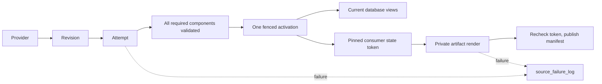

# Revisioned sources

A source builds privately. One activation makes its complete component set visible. Consumers publish from a pinned state independently.



| Term | Meaning |
| --- | --- |
| Revision | Adapter-validated immutable identity and normalized content for a bounded partition. |
| Attempt | A fresh UUID isolating every write made by one build. |
| Component | One required output whose count, keys, bounds and hash have been checked. |
| Activation | A monotonically numbered record selecting one complete attempt. |
| Route | A later, separately approved switch of an existing public identity to the new source. |
| Lock | Shared single-host `flock` exclusion; canonical operations take heavy then partition, while provisional operations take their partition lock. |
| Consumer | An independent publisher that pins the active state, renders privately, and checks its token before replacing a manifest. |

## Add a source

1. Use `binance_spot_trades.py` as the worked example: one typed specification, explicit component and consumer functions, and adapter-owned authority. For a new provider, first implement its canonical/provisional adapter contracts; do not copy Binance authority into the kernel.
2. Retain unmodified official rows and provenance under `tests/fixtures/<provider>/...`; record archive and response hashes. Synthetic market rows are prohibited.
3. Add the specification to `SOURCE_REGISTRY` in `registry.py`, with `RolloutStage.DORMANT`.
4. Run `pytest tests/origo_source_native/test_binance_daily_source_adapter.py tests/origo_source_native/test_revisioned_source_framework*.py -q`, then `pytest tests/origo_source_native -q` and the repository gates.
5. Inspect the generated definitions. All schedules and sensors must remain stopped; only explicit setup may perform I/O while dormant.
6. Submit the source and its proofs in one slice PR. A new provider still uses this checklist and the same failure table.

The spot adapter stores individual trades. Aggregate responses locate the REST range; historicalTrades supplies rows. All five canonical projection calculations and the twelve consumer series reuse the frozen spot formulas. The shadow implementation leaves legacy identities and artifacts intact. Publication destinations must contain the source key.

## Run and promote

Use one code location and an absolute shared `ORIGO_SOURCE_LOCK_DIR` (default `/opt/origo/locks`) visible to every worker. Multi-host execution is unsupported. Setup creates isolated source objects and the shared state tables:

```sh
dagster job execute -m origo.definitions -j create_binance_spot_trades_source_origo_job
```

The registered spot specification is now `CANARY`. New sources still enter the registry as `DORMANT`. Dagster schedules and sensors remain stopped until an operator starts them. Neither importing definitions nor deployment starts ingestion or creates source tables.

### Backfill and compare from Dagit

1. Open **Jobs → create_binance_spot_trades_source_origo_job → Launchpad** and launch setup. The default coverage anchor is `2017-08-17T00:00:00+00:00`; an explicitly configured anchor is immutable. Offset-less dates/times mean UTC.
2. Start **binance_spot_trades_reconciliation_sensor** and **binance_spot_trades_failure_sensor**. Reconciliation reads ClickHouse state, bridges durable failure/recovery events into a Dagster run, and requests native verification runs. Backfill, repair and audit jobs reject execution until both monitors are running. Keep the canonical/provisional schedules and consumer sensors stopped for the historical proof.
3. Open **backfill_binance_spot_trades_source_job → Launchpad**. Select one representative high-volume day already available in the legacy history and not yet verified by the new source. Launch that single partition with:

   ```yaml
   ops:
     build_binance_spot_trades_canonical_revision_origo:
       config:
         capacity_probe: true
   ```

   The probe runs ingestion and independent legacy comparison, measures the mounted volumes, and persists the largest observed working set. It cannot run as a range backfill. A failed probe retains valid measurements but creates no capacity approval; retry it with `capacity_probe: true` until verification succeeds. A verified day cannot serve as a new probe because its cached proof would skip the legacy working set. After a storage move or ClickHouse server replacement, launch an unverified representative day as a new probe; automatic daily ingestion does not grant its own capacity approval.
4. Open **Assets → binance_spot_trades → build_binance_spot_trades_canonical_revision_origo → Partitions**. Select `2017-08-17` through the last closed UTC day and launch the native backfill with default configuration. One day runs at a time in the source's Dagster concurrency pool; source locks also exclude competing writers. The `backfill_binance_spot_trades_source_job` exposes the same partitioned asset.
5. Follow the native backfill and partition views. Each materialization's `source_state` metadata contains the official archive revision, build ID, generation, verification time, and all seven legacy comparison counts/hashes. A day materializes only after the complete committed generation passes content validation and exact legacy parity. Failed attempts retain their original run history.
6. Open the partition's run **Logs** for archive, component, comparison, capacity, failure and recovery events. **Compute logs** retain stdout/stderr. The **reconcile_binance_spot_trades_source_origo** asset reports the last successful authority read; its **source_health** check reports unresolved source failures without failing the observation run; its runs also show failures originally recorded outside a run, tagged with their original run ID. Database-read failure is a failed reconciliation, never an empty or successful snapshot.
7. Fix the recorded cause, then use Dagit's native failed-partition retry/backfill controls. Unchanged complete generations retain their activation and reuse matching parity evidence after validating current contents. An archive correction receives a new generation and new proof. Retries first reclaim any interrupted legacy comparison workspace under the source lock. The cleanup job exposes that workspace in `verification_databases` during its dry run. Storage or source-wide health failures stop work before archive download; queued Dagster runs may already exist.
8. Historical parity is complete only when the entire selected history is verified, with no failed/missing partitions and healthy reconciliation. A green fixture test or a successful setup/probe is not full-history evidence. Keep production legacy readers and publishers on their existing paths until the later routing cutover.

Dagit reflects the most recently reconciled state, not an atomic transaction with ClickHouse. The sensor checks changed generations, missing materializations and failed partitions each minute, and rotates through partitions whose last verification is at least 24 hours old for content validation. Dagster materialization data versions identify unchanged generations; a completed native backfill does not immediately trigger another verification. Changed/failed days are prioritized; at most five verification runs form one batch. The sensor waits for that batch to finish before requesting another, while continuing health observations. Health runs bridge new events no more often than every five minutes and otherwise provide an hourly heartbeat. Failed health checks remain visible between observations. Sensor ticks retain seven days of success/skips and thirty days of failures; the cursor stores only the rotation offset. It recognizes canonical jobs and native Dagit backfill jobs under both single-partition and partition-range tags, and skips a day while any source run for it is queued or active. A deterministic data/configuration failure holds automatic verification for the observed revision/build/generation until the identity changes or an operator retries. Transient failures, lost workers and cancellations retry after 1, 5, 30 and then at most once per 60 minutes; these waits release the heavy pool. Reconcile-only failures are verification failures and never create an ingestion-retry requirement. A successful operator verification resumes periodic checks; it does not erase the failed run. For an immediate exhaustive verification, launch a native backfill of the desired range with `reconcile_only: true`. This reads/compares active data without rebuilding it. A generation without matching proof must pass capacity admission before its legacy comparison. Inspect `verified_at` and reconciliation health when assessing freshness; disabled or failing reconciliation is not current authority.

Normal ingestion uses hourly op retries only for explicitly transient provider failures (transport, 404/408/418/429/5xx) and revision changes. Configuration, validation, permission and lock failures terminate the run immediately. An operator can retry after fixing the reported cause. Within one run, ingestion and the frozen legacy parser share checksum-verified archive bytes; retained content is independently read after legacy comparison before materialization. Cleanup failures are logged without replacing the primary error.


Dagster and Dagit are pinned to the tested `1.13.21` runtime in project and Docker dependencies. The checked-in instance configuration captures Python logging and compute logs, persists logs in the shared Dagster volume, and limits source pools to one run. Both compose variants mount the same lock volume and a read-only view of the actual ClickHouse data volume. Capacity admission validates the server UUID and local default disk, checks all declared mounts, and requires at least 30% free bytes, twice the largest measured working set, and 10% free inodes. A changed volume needs a new probe. The first probe only proves its selected day; subsequent days retain valid measurements, including failed attempts, while only successful verification grants admission.

`LIVE` promotion remains a separate reviewed slice requiring seven consecutive production handoffs and consumer evidence. Historical spot parity precedes futures reuse and live certification. This slice changes no public spot route or publisher ownership.

For rollback, stop the source schedules and call `SourceRuntime.rollback(record, operator=..., reason=...)` for a retained complete build. It appends a new activation; it does not delete data. An older official revision additionally requires `quarantine=True` and remains critical until the official revision is restored. Run cleanup with `dry_run=True` first and inspect its exact build IDs. Active builds are retained; cleanup and rollback share the heavy-then-partition lock order.

## Failure scope

| Scope | Blocking effect |
| --- | --- |
| `NONE` | Diagnostic, audit or cleanup work only; no database activation dependency. |
| `CONSUMER` | That publisher only; database and other consumers continue. |
| `PARTITION` | The affected partition attempt only; its previous complete generation stays visible. |
| `SOURCE` | An explicitly source-wide prerequisite only. |
| `ROUTE` | The named future route change only; the current route stays active. |

Handled failures record before re-raising. The stopped run-failure observer records uncaught job/worker failures when enabled. Recovery and acknowledgement append to the same failure key; deterministic event IDs make logger retries idempotent. Successful component and activation tables are correctness evidence, not alternate failure histories. Canonical discovery records its partition before provider I/O; the hourly audit retries up to five oldest requested partitions that have never activated, so a missing sidecar cannot drop a day. Canonical run keys still include the validated revision.

```sql
SELECT source_key, failure_key,
       argMax((event_type, severity, blocking_scope, operation, partition_key,
               component, consumer, error_code, message, dagster_run_id), event_time) AS latest
FROM origo.source_failure_log
GROUP BY source_key, failure_key
ORDER BY source_key, failure_key;
```

## Change the contract

When evidence invalidates the slice, capture the failing command and exact proposed issue-body edit. Obtain explicit `zero-bang` confirmation, then update every affected assertion, signature, surface and proof before continuing:

```sh
gh issue view 309 --repo Vaquum/Origo --json body
gh issue edit 309 --repo Vaquum/Origo --body-file approved-slice.md
```

CI success, silence, or a workaround is not approval to change the contract.

## Operational metadata maintenance

`maintain_operational_metadata_job` is the Dagit entry point. The
`operational_metadata_maintenance_schedule` runs every 10 minutes; deployment launches
this same job through the configured project workspace. Deployments start in inspection mode. The configured SQLite adapters
fix the Jobs-page repository query and preserve current materialization/observation
IDs, tags, data versions and partition facts after their old run details expire.
ClickHouse's native 14-day diagnostic TTL operates independently of this schedule.
Source tables, reconciliation state, accepted revisions and published data are outside
this retention policy.

Source ingestion, mixed ingestion/projection jobs and unknown jobs retain their run
records indefinitely. The explicit policy is `origo/maintenance/roles.py`;
`origo_source_key` also marks source work. Run deletion itself checks this policy
atomically, so a source tag added after inventory still prevents retirement.
Source provenance includes the full event history, acceptance/failure evidence,
source generation and validation references. After one hour without shard activity,
terminal source event databases are losslessly compressed into
`operational-maintenance/source-archive.sqlite`. Dagit reads the original database
schema from memory, preserving event IDs, timestamps, payloads and pagination.
The shared run/event indexes also compress source JSON payloads losslessly;
query keys, statuses, timestamps, tags and every historical entry remain intact.
Both Origo adapters decode these versioned, checksummed payloads transparently.
Direct SQLite inspection must use `origo.maintenance.sqlite.connection` to obtain
decoded rows. Keep the compatible adapters when rolling back application code;
an older adapter cannot read the packed format. Captured logs are retained.
A late event restores the shard durably under its writer lock before appending; interrupted transitions prefer the committed,
checksum-verified archive. Corrupt images fail visibly rather than creating empty
history. Images above 64 MiB remain unmodified and appear as an inventory exclusion.
Dagster schema upgrades migrate one packed database at a time during an outage.

Explicit projection jobs include bars, derived depth tables, Arrow and published
files. Successful histories are eligible after a one-minute shutdown grace; resolved failed/canceled
histories after 24 hours. Current asset facts keep their original IDs, tags, input
versions and partitions after a projection run expires. Active runs, active/unknown
backfills, retries, current checks, unresolved failures and unconsumed sensor events
remain protected. Later materializations for every planned asset can resolve an older failure even after the successful run records expire; that run’s own materializations cannot clear its failure. Fresh checks precede each deletion. Unchanged Parquet inputs do
not launch another Arrow build. Terminal successful/skipped sensor and schedule
ticks expire after one day; failed ticks after seven days. Instigator cursors and
source run evidence are independent of those operational tick logs.

### First inspection and cleanup

1. In Dagit, launch `maintain_operational_metadata_job` with the configuration below.
   The deployment default permits at most ten minutes, in batches of at most 500 runs.
   Scan, reclamation and compaction use a separate work deadline. Reporting gets
   10% of runtime, bounded to 15–300 seconds and at most half the usable runtime
   for short invocations. Exhausting the work window reports the last durable
   checkpoint and resumes on the next invocation. Disk measurement counts allocated
   blocks without following symlinks, counts hard links once, and logs paths that disappear during
   traversal. Missing configured roots, permission and I/O errors still fail the run,
   as does exhausting the absolute reporting deadline.
   Inventory reads at most 500 run records in run-ID order, without sorting the
   remaining backlog. Retry references and sensor state are loaded once per batch;
   one read-only event connection is scoped to the batch. Reclamation still checks
   fresh dependencies for each run under its writer lock.
   Each completed batch checkpoints its cursor. Repeat until the result says
   `inventory_complete: true`; an incomplete inventory is not a deletion approval.
   Once an eligible first manifest has a complete inventory, scheduled and deploy
   dry runs preserve its inventory totals, retained floor and manifest through
   backup preparation and review. Health, current disk usage and diagnostic checks
   continue. Inventories without eligible runs continue scanning; first apply or a
   retention-policy change permits a new inventory cycle.
2. Read `maintenance` in the health check metadata and its `journal_path`. The one
   journal contains the exact first manifest, artifact paths/allocated bytes,
   exclusions, `archive`/`retire` actions and SHA-256. The physical ceiling defaults
   to 13 GiB; health also requires strictly less than 10% of ClickHouse active
   business-data bytes. Shared databases, source archives, live shards, logs and
   maintenance state all count. Diagnostic tables never inflate the denominator.
   An over-budget instance may perform approved cleanup, but its check remains
   failed until actual physical usage meets both limits. The old retained-floor
   estimate includes reusable SQLite pages and is not an admission barrier.
3. Before first apply, take a consistent snapshot of **the entire Dagster instance**
   and compute logs using the storage platform's atomic snapshot facility, or a
   controlled writer-quiesced copy. Copying separate live SQLite files is not a
   consistent instance backup. Restore it on a separate filesystem outside the
   production reserve; rewrite its `dagster.yaml` paths to that restored directory.
   Keep the original run-storage instance ID and both configured Origo adapters.
4. From the deployed application environment, verify that restored instance using
   `python -m origo.maintenance.worker --config '<inspection JSON>'
   --verify-restored-home /mnt/off-volume/origo-restore --snapshot-id '<snapshot ID>'`.
   Save the returned JSON as the backup receipt. Verification checks database
   integrity, instance identity and the manifest's run/shard evidence. The operator
   supplies the snapshot's consistency guarantee; this command does not create a
   backup or turn a live file copy into one.
5. Review the exact manifest. In Dagit set `dry_run: false`, the measured budget,
   `backup_receipt` to the readable receipt path and `approved_manifest_sha256` to
   that exact manifest hash. The first batch requires a matching, unexpired receipt;
   later batches use the durable first-apply checkpoint and revalidate each run.
   Failure/timeout is a failed run and check, with progress retained for another run.
6. After the first batch's state and physical release have been reconciled, enable
   recurring apply with repository variables `ORIGO_METADATA_DRY_RUN=false`,
   `ORIGO_OPERATIONAL_METADATA_BUDGET_BYTES=<measured bytes>` and
   `ORIGO_METADATA_MAX_RUNTIME_SECONDS=600`, then deploy. Repeat bounded Dagit
   invocations during catch-up until eligible backlog declines faster than ingress.

```yaml
ops:
  maintain_operational_metadata:
    config:
      dry_run: true
      projection_success_minutes: 1
      projection_failure_hours: 24
      source_archive_after_hours: 1
      diagnostic_retention_days: 14
      max_runs_per_batch: 500
      max_runtime_seconds: 600
      lock_wait_seconds: 1
      metadata_budget_bytes: 13958643712
```

The first manifest stays available across inspection batches. Its initial eligibility
reason is immutable; live revalidation exclusions are separate progress fields and
do not invalidate the approved hash or backup receipt. Policy changes reset
inspection; finish an interrupted deletion before changing policy. The journal holds
at most 500 candidates and 32 aggregate reports from the last 30 days. The backup
receipt expires after 30 days. Configure the external backup service to expire these
maintenance snapshots after 30 days; Origo does not delete external backups.

### Reading the result

All worker output and exceptions flow into Dagit logs. The blocking
`operational_metadata_health` check reports candidate/protected/deleted/archived counts,
exclusion reasons, age-eligible projection backlog (including protected projections), inferred eligible
arrival rate, cleanup rate, query p95, byte budget, last healthy invocation and free
filesystem bytes. Arrival rate uses the observed backlog change plus deletions;
concurrent manual deletion can understate arrivals. Active cleanup throughput and
between-invocation cleanup rate are separate measurements. Required state is never
deleted to force a budget to pass.

`reclaimed_bytes` includes removed projection artifacts, net source-archive savings
and measured shared-database release. `shared_sqlite.*.reusable_bytes` is still
allocated until page reclamation returns it to the filesystem. Initial conversion
requires a controlled outage with all Dagster/Dagit writers quiesced and a verified
backup. Run `python tools/metadata_compact_sqlite.py --instance-home <home>
--backup-receipt <receipt.json> --writers-quiesced --max-runtime-seconds 900` under
an independent timeout that always resumes both services. It copies no rows between
logical histories: SQLite VACUUM preserves records and enables incremental vacuum.
A failed conversion leaves the original committed database recoverable. Subsequent
maintenance reclaims free pages in bounded transactions and checkpoints the WAL;
`sqlite_compaction_not_initialized` identifies databases still needing conversion.
Do not run initial VACUUM against active production writers. Preserve the full
maintenance output and attach it to the Dagit maintenance run after services resume.
 ClickHouse reports active, inactive and
expired part bytes separately from actual allocated blocks and net physical release.
A scheduled TTL operation is not claimed as reclaimed space.

ClickHouse catch-up first flushes configured system logs, creating empty tables for
unused logs such as crash/backup logs before auditing their TTLs. It then validates
the explicit diagnostic table allowlist and archived numeric schema incarnations. It drops only parts whose actual maximum event time is
older than 14 days. Mixed-age partitions use at most one asynchronous TTL mutation,
with a 4 GiB partition limit and at least 20 GiB plus twice the partition's bytes free.
Concurrent merges/mutations exclude their tables. Inventory limits (500 system
MergeTree tables, 5,000 diagnostic parts) fail visibly instead of applying an
incomplete inventory. TTL drift, lag over the configured allowance, failed mutations,
unknown growing system tables and insufficient catch-up capacity fail the health
check. Native TTL may release inactive parts later; repeated measurement establishes
physical recovery. The OpenTelemetry timestamp is microseconds and is converted to
seconds before applying the same retention window.

Production acceptance remains a deployment step: run the unchanged setup/Arrow
GraphQL job-history queries 20 times, require p95 ≤250 ms after restart and under
normal ingestion, inspect the Jobs page, then reconcile the reviewed cleanup batch.
Only measured recovered space counts toward the backfill reserve.

Migration acceptance additionally requires `python tools/metadata_capacity_report.py
--evidence <measured-evidence.json>`. Its schema is `CapacityEvidence`: every source
identity and history must match, all retained captured logs must be verified, current
Dagit state must match, and an actual replay at ten times observed ingress must leave
no growing projection backlog. Missing proof or a failed storage/latency condition
exits nonzero. Compression samples and lower-bound capacity estimates do not certify
production. Source retention grows with authoritative coverage; if required evidence
cannot fit the capacity limits, the check fails instead of discarding it.


Small asset outputs (up to 64 KiB in Dagster's existing serialized form) share
`storage/.origo-outputs.sqlite`. Their bytes and checksums are preserved; normal
Dagster input loads, partition paths and overwrite behavior use the packed IO
manager. New handled-output metadata identifies the database and its storage key.
Larger values and run-scoped op outputs keep their filesystem representation.
Both services select `origo.maintenance.io_manager.packed_io_manager` through
Dagster's default IO-manager environment settings; silent fallback is disabled.

After every writer uses that manager, migrate existing asset outputs with
`python tools/metadata_pack_outputs.py --instance-home <home> --backup-receipt
<receipt.json> --all-writers-use-packed-io --max-runtime-seconds 600`. It uses the
same per-output locks as live writes, commits at most 100 values together, verifies
all committed bytes, and only then unlinks their original files. Interrupted runs
resume from remaining files. A conflicting raw/packed value fails visibly and
retains both. Preserve this migration's output with the maintenance run. Rollback
must retain the packed IO manager as well as both compatible SQLite adapters.

A source run whose history is still being read or written is deferred to the next
inventory. Lock contention is reported as `source_in_use`, leaves the source
history intact, and creates no compaction error; unrelated projection retirement
continues. Genuine snapshot, integrity and I/O failures retain their error status
until compaction succeeds.

Source event transitions lock only the affected run. A slow archive or historical
read cannot take a global lock away from unrelated runs' live logging. Packed
reads release the transition lock after obtaining their immutable image. Database
upgrades and instance wipes retain Dagster's quiesced-instance requirement.

Local run-status sensor dependencies are matched by repository as well as job name.
A cursor left by a renamed code location cannot pin a different repository's new
projection runs. Current repository cursors still protect unconsumed events. Failure
protection tests for a newer matching run directly, without sorting all historical
runs to find the latest one.

A source shard that cannot be compacted does not stop unrelated projection
retirement. Its original history remains available; the full exception reaches
Dagit logs and a per-run error stays in the archive database. The health check
continues to fail with the unresolved count and a bounded sample of errors across
later invocations. Successful compaction clears that run's error. A failure after
archive commit still retries its unfinished shared-JSON compaction. Work deadlines
remain resumable checkpoints; a broken shared storage backend still fails the job.
