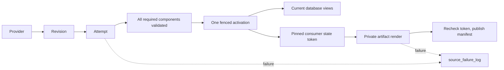

# Revisioned sources

A source builds privately. One activation makes its complete component set visible. Consumers publish from a pinned state independently.



| Term | Meaning |
| --- | --- |
| Revision | Adapter-validated immutable identity and normalized content for a bounded partition. |
| Attempt | A fresh UUID isolating every write made by one build. |
| Component | One required output whose count, keys, bounds and hash have been checked. |
| Activation | A monotonically numbered record selecting one complete attempt. |
| Route | A later, separately approved switch of an existing public identity to the new source. |
| Lock | Shared single-host `flock` exclusion; canonical operations take heavy then partition, while provisional operations take their partition lock. |
| Consumer | An independent publisher that pins the active state, renders privately, and checks its token before replacing a manifest. |

## Add a source

1. Use `binance_spot_trades.py` as the worked example: one typed specification, explicit component and consumer functions, and adapter-owned authority. For a new provider, first implement its canonical/provisional adapter contracts; do not copy Binance authority into the kernel.
2. Retain unmodified official rows and provenance under `tests/fixtures/<provider>/...`; record archive and response hashes. Synthetic market rows are prohibited.
3. Add the specification to `SOURCE_REGISTRY` in `registry.py`, with `RolloutStage.DORMANT`.
4. Run `pytest tests/origo_source_native/test_binance_daily_source_adapter.py tests/origo_source_native/test_revisioned_source_framework*.py -q`, then `pytest tests/origo_source_native -q` and the repository gates.
5. Inspect the generated definitions. All schedules and sensors must remain stopped; only explicit setup may perform I/O while dormant.
6. Submit the source and its proofs in one slice PR. A new provider still uses this checklist and the same failure table.

The spot adapter stores individual trades. Aggregate responses locate the REST range; historicalTrades supplies rows. All five canonical projection calculations and the twelve consumer series reuse the frozen spot formulas. The shadow implementation leaves legacy identities and artifacts intact. Publication destinations must contain the source key.

## Run and promote

Use one code location and an absolute shared `ORIGO_SOURCE_LOCK_DIR` (default `/opt/origo/locks`) visible to every worker. Multi-host execution is unsupported. Setup creates isolated source objects and the shared state tables:

```sh
dagster job execute -m origo.definitions -j create_binance_spot_trades_source_origo_job
```

The registered spot specification is now `CANARY`. New sources still enter the registry as `DORMANT`. Dagster schedules and sensors remain stopped until an operator starts them. Neither importing definitions nor deployment starts ingestion or creates source tables.

### Backfill and compare from Dagit

1. Open **Jobs → create_binance_spot_trades_source_origo_job → Launchpad** and launch setup. The default coverage anchor is `2017-08-17T00:00:00+00:00`; an explicitly configured anchor is immutable. Offset-less dates/times mean UTC.
2. Start **binance_spot_trades_reconciliation_sensor** and **binance_spot_trades_failure_sensor**. Reconciliation reads ClickHouse state, bridges durable failure/recovery events into a Dagster run, and requests native verification runs. Backfill, repair and audit jobs reject execution until both monitors are running. Keep the canonical/provisional schedules and consumer sensors stopped for the historical proof.
3. Open **backfill_binance_spot_trades_source_job → Launchpad**. Select one representative high-volume day already available in the legacy history and not yet verified by the new source. Launch that single partition with:

   ```yaml
   ops:
     build_binance_spot_trades_canonical_revision_origo:
       config:
         capacity_probe: true
   ```

   The probe runs ingestion and independent legacy comparison, measures the mounted volumes, and persists the largest observed working set. It cannot run as a range backfill. A failed probe retains valid measurements but creates no capacity approval; retry it with `capacity_probe: true` until verification succeeds. A verified day cannot serve as a new probe because its cached proof would skip the legacy working set.
4. Open **Assets → binance_spot_trades → build_binance_spot_trades_canonical_revision_origo → Partitions**. Select `2017-08-17` through the last closed UTC day and launch the native backfill with default configuration. One day runs at a time in the source's Dagster concurrency pool; source locks also exclude competing writers. The `backfill_binance_spot_trades_source_job` exposes the same partitioned asset.
5. Follow the native backfill and partition views. Each materialization's `source_state` metadata contains the official archive revision, build ID, generation, verification time, and all seven legacy comparison counts/hashes. A day materializes only after the complete committed generation passes content validation and exact legacy parity. Failed attempts retain their original run history.
6. Open the partition's run **Logs** for archive, component, comparison, capacity, failure and recovery events. **Compute logs** retain stdout/stderr. The **reconcile_binance_spot_trades_source_origo** asset reports authority-read health and last-observed time; its runs also show failures originally recorded outside a run, tagged with their original run ID. Database-read failure is a failed reconciliation, never an empty or successful snapshot.
7. Fix the recorded cause, then use Dagit's native failed-partition retry/backfill controls. Unchanged complete generations retain their activation and reuse matching parity evidence after validating current contents. An archive correction receives a new generation and new proof. Storage or source-wide health failures stop work before archive download; queued Dagster runs may already exist.
8. Historical parity is complete only when the entire selected history is verified, with no failed/missing partitions and healthy reconciliation. A green fixture test or a successful setup/probe is not full-history evidence. Keep production legacy readers and publishers on their existing paths until the later routing cutover.

Dagit reflects the most recently reconciled state, not an atomic transaction with ClickHouse. The sensor checks changed generations, missing materializations and failed partitions each minute, and rotates through older partitions for content validation. Changed/failed days are prioritized; at most five verification runs form one batch. The sensor waits for that batch to finish before requesting another, while continuing health observations. For an immediate exhaustive verification, launch a native backfill of the desired range with `reconcile_only: true`. This reads/compares active data without rebuilding it. A generation without matching proof must pass capacity admission before its legacy comparison. Inspect `verified_at` and reconciliation health when assessing freshness; disabled or failing reconciliation is not current authority.

Dagster and Dagit are pinned to the tested `1.13.21` runtime in project and Docker dependencies. The checked-in instance configuration captures Python logging and compute logs, persists logs in the shared Dagster volume, and limits source pools to one run. Both compose variants mount the same lock volume and a read-only view of the actual ClickHouse data volume. Capacity admission validates the server UUID and local default disk, checks all declared mounts, and requires at least 30% free bytes, twice the largest measured working set, and 10% free inodes. A changed volume needs a new probe. The first probe only proves its selected day; subsequent days retain valid measurements, including failed attempts, while only successful verification grants admission.

`LIVE` promotion remains a separate reviewed slice requiring seven consecutive production handoffs and consumer evidence. Historical spot parity precedes futures reuse and live certification. This slice changes no public spot route or publisher ownership.

For rollback, stop the source schedules and call `SourceRuntime.rollback(record, operator=..., reason=...)` for a retained complete build. It appends a new activation; it does not delete data. An older official revision additionally requires `quarantine=True` and remains critical until the official revision is restored. Run cleanup with `dry_run=True` first and inspect its exact build IDs. Active builds are retained; cleanup and rollback share the heavy-then-partition lock order.

## Failure scope

| Scope | Blocking effect |
| --- | --- |
| `NONE` | Diagnostic, audit or cleanup work only; no database activation dependency. |
| `CONSUMER` | That publisher only; database and other consumers continue. |
| `PARTITION` | The affected partition attempt only; its previous complete generation stays visible. |
| `SOURCE` | An explicitly source-wide prerequisite only. |
| `ROUTE` | The named future route change only; the current route stays active. |

Handled failures record before re-raising. The stopped run-failure observer records uncaught job/worker failures when enabled. Recovery and acknowledgement append to the same failure key; deterministic event IDs make logger retries idempotent. Successful component and activation tables are correctness evidence, not alternate failure histories. Canonical discovery records its partition before provider I/O; the hourly audit retries up to five oldest requested partitions that have never activated, so a missing sidecar cannot drop a day. Canonical run keys still include the validated revision.

```sql
SELECT source_key, failure_key,
       argMax((event_type, severity, blocking_scope, operation, partition_key,
               component, consumer, error_code, message, dagster_run_id), event_time) AS latest
FROM origo.source_failure_log
GROUP BY source_key, failure_key
ORDER BY source_key, failure_key;
```

## Change the contract

When evidence invalidates the slice, capture the failing command and exact proposed issue-body edit. Obtain explicit `zero-bang` confirmation, then update every affected assertion, signature, surface and proof before continuing:

```sh
gh issue view 309 --repo Vaquum/Origo --json body
gh issue edit 309 --repo Vaquum/Origo --body-file approved-slice.md
```

CI success, silence, or a workaround is not approval to change the contract.
